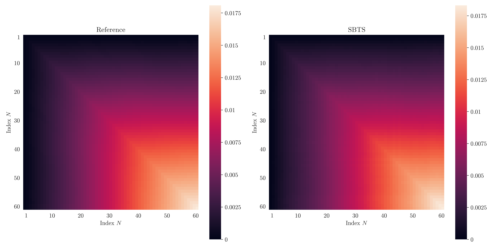

### Generative modeling for time series via Schrödinger bridge 

This repository reproduces the results of :
- [Hamdouche, Henry-Labordere and Pham (2023)](https://arxiv.org/pdf/2304.05093),
- [Alouadi, Barreau, Carlier and Pham (2025)](https://arxiv.org/pdf/2503.02943).

We implement: 

### Examples of illustrations 

### Disclaimer 
Source code is available upon request. Please contact me directly. 