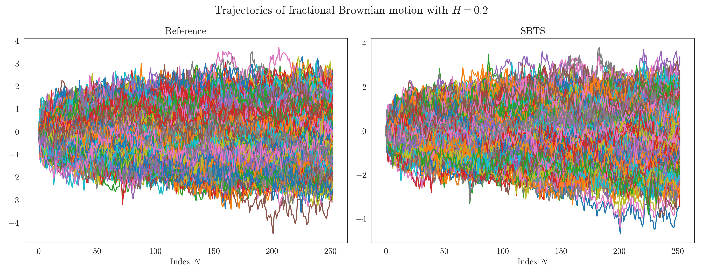
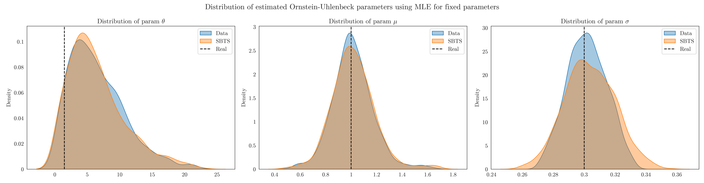
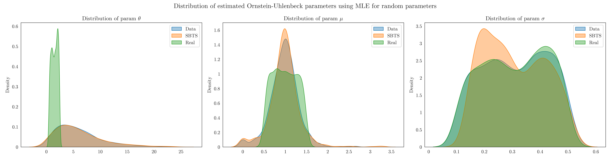
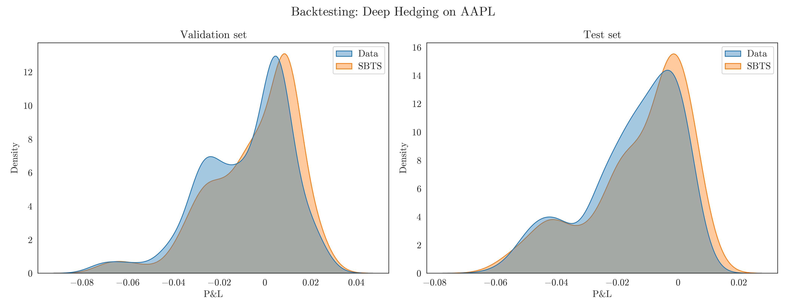
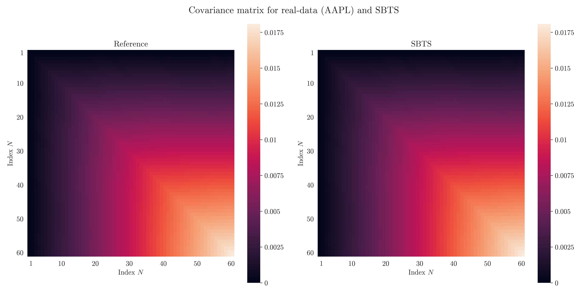

### Generative modeling for time series via Schrödinger bridge 

This repository reproduces the results of :
- [Hamdouche, Henry-Labordere and Pham (2023)](https://arxiv.org/pdf/2304.05093),
- [Alouadi, Barreau, Carlier and Pham (2025)](https://arxiv.org/pdf/2503.02943).

We implement: 
- a robustness test based on a parametric simulation–estimation pipeline, using MLE to compare parameter distributions inferred from real data and model-generated synthetic data, thereby assessing the model’s ability to capture a distribution of distributions. The approach is tested on Ornstein–Uhlenbeck, 2D Black–Scholes, and Heston processes (see `test_OU.ipynb`, `test_BS.ipynb`, and `test_Heston.ipynb`).
- a complete backtest of this method by performing deep hedging of a call option on the `AAPL` ticker (see `test_DeepHedging.ipynb`).

### Examples of illustrations 

### Disclaimer 
Source code is available upon request. Please contact me directly. 